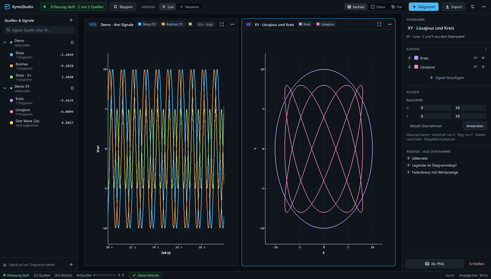
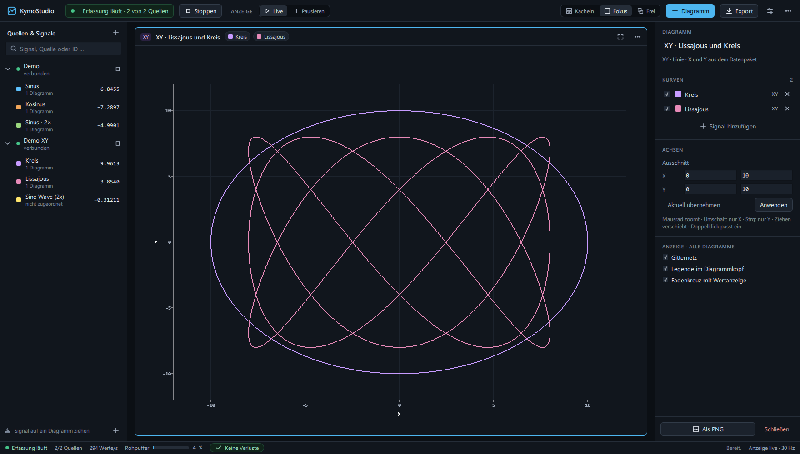
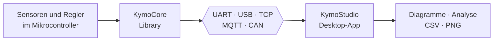

<p align="center">
  <a href="README.md"></a>
  <a href="README.de.md"></a>
</p>

<p align="center">
  <picture>
    <source media="(prefers-color-scheme: dark)" srcset="docs/brand/kymotrace-logo-dark.svg">
    
  </picture>
</p>

<h3 align="center">KymoStudio · Live-Messdaten sehen, verstehen und auswerten</h3>

<p align="center">
  Die Desktop-Arbeitsfläche für Messwerte aus Mikrocontrollern, Sensoren und Netzwerken.
</p>

<p align="center">
  
  
  
  
</p>

<p align="center">
  
</p>

---

## Worum geht es?

Wer mit Mikrocontrollern, Sensoren oder Regelungen arbeitet, kennt das: Die
interessanten Werte stecken im Gerät, und um sie zu sehen, bleiben nur
`Serial.print`, ein einfacher Plotter mit einer einzigen Kurve oder das
mühsame Auswerten von Logdateien.

**KymoStudio** holt diese Daten live auf den Bildschirm, und zwar richtig:
- mehrere Quellen gleichzeitig
- beliebig viele Signale auf mehreren Diagrammen
- echte XY- und 3D-Darstellungen statt nur Kurven über der Zeit
- Analyse und Export, ohne die Aufzeichnung zu unterbrechen

Das Ziel ist ein Werkzeug, das sich anfühlt wie ein gutes Messgerät:
**präzise, ruhig und ehrlich**. Die Oberfläche zeigt jederzeit, ob Daten
ankommen, ob etwas verloren geht und was gerade dargestellt wird. Dekorative
Effekte gibt es nicht. Im Mittelpunkt steht die Messaufgabe.

## Was KymoStudio kann

| | |
|---|---|
| **Viele Quellen gleichzeitig** | Seriell (UART/USB), TCP, MQTT, CAN und ein eingebauter Testgenerator. Jede Quelle lässt sich einzeln starten und stoppen. |
| **Versteht deine Daten** | Das kompakte Kymotrace-Binärprotokoll, einfache Zahlen als Text oder JSON. Das Format wird automatisch erkannt. |
| **Vier Diagrammtypen** | Zeitverlauf Y(t), XY-Linie, XY-Punkte und XYZ in 3D. X und Y kommen dabei direkt aus dem Datenpaket. |
| **Flexible Arbeitsfläche** | Diagramme kacheln, eines in den Fokus holen oder frei anordnen. Signale per Drag & Drop zuordnen. |
| **Genau hinsehen** | Mausrad-Zoom, Verschieben, Einpassen per Doppelklick und Fadenkreuz mit Wertanzeige. Achsen lassen sich auch manuell festlegen. |
| **Analyse** | Anzahl, Minimum, Maximum, Mittelwert, Effektivwert (RMS) und Standardabweichung, berechnet aus den Rohdaten, nicht aus der Anzeige. |
| **Export** | Rohdaten als CSV, die Arbeitsfläche als PNG, die Konfiguration als JSON. |
| **Pausieren ohne Datenverlust** | Die Anzeige anhalten, während die Erfassung im Hintergrund weiterläuft. |
| **Transparent unter Last** | Begrenzte Puffer, Zähler für verworfene Werte und eine Statusleiste, die zeigt, was wirklich passiert. |

<p align="center">
  
  <br><sub>Echte XY-Bahnen: Kennlinien, Trajektorien oder Lissajous-Figuren direkt aus dem Datenstrom.</sub>
</p>

## Wofür man es einsetzt

- **Regelungstechnik:** Soll-, Ist- und Stellgröße eines PID-Reglers nebeneinander sehen und Parameter live einstellen.
- **Sensorentwicklung:** Rauschen, Drift und Sprungantwort sichtbar machen und mit Statistik belegen.
- **Antriebe und Leistungselektronik:** Strom, Spannung, Drehzahl und Position parallel verfolgen.
- **Robotik und Bewegung:** Bahnen und Positionen als XY- oder 3D-Darstellung statt als Zahlenreihen.
- **Prüfstand und Fahrzeug:** Signale aus CAN-Bus und MQTT gemeinsam mit seriellen Quellen auswerten.
- **Lehre, Studium und Maker-Projekte:** Physik und Elektronik anschaulich machen. Der Testgenerator funktioniert auch ganz ohne Hardware.

## Das Kymotrace-Ökosystem



| Projekt | Rolle |
|---|---|
| **[KymoStudio](https://github.com/CodeName-666/kymostudio)** | dieses Repository: empfangen, darstellen, analysieren, exportieren |
| [KymoCore](https://github.com/CodeName-666/kymocore) | portable C++11-Library, die Messwerte im Mikrocontroller erfasst und sendet |
| [KymoProbe](https://github.com/CodeName-666/kymoprobe) | fertige Firmware und Beispiele für ESP32, Arduino und STM32 |

KymoStudio funktioniert auch ohne KymoCore. Jede Quelle, die Zahlen als Text
oder JSON sendet, lässt sich direkt anzeigen.

## Schnell ausprobieren

Mit Python 3.12. Die Demo braucht keine Hardware:

```bash
python -m venv .venv
.venv/Scripts/python -m pip install -r requirements.txt     # Linux/macOS: .venv/bin/python
.venv/Scripts/python run.py --demo
```

Unter Windows startet danach auch `start_windows.bat` die Anwendung.
Installation, Bedienung, Tastenkürzel, Grenzen und Konfiguration beschreibt das
**[Handbuch](docs/MANUAL.de.md)**.

## Dokumentation

- **[Handbuch](docs/MANUAL.de.md):** Installation, Bedienung, Datenintegrität, Konfiguration und Prüfungen
- **[Architektur](docs/ARCHITEKTUR.md):** Aufbau von Python-Backend und QML-Oberfläche
- **[Testbericht](docs/TESTBERICHT.md)** · **[Änderungen](CHANGELOG.md)** · **[Logo und Gestaltung](docs/brand/BRAND.md)** · **[Mitmachen](CONTRIBUTING.de.md)**

## Lizenz

Copyright (c) 2026 Christof Seidel. KymoStudio ist doppelt lizenziert:

- **GPLv3** ([LICENSE](LICENSE)) ist kostenlos, etwa für Hobby, Basteln,
  Lernen und Open-Source-Projekte.
- Eine **kommerzielle Lizenz** braucht, wer KymoStudio in proprietären
  Produkten weitergibt. Unternehmen werden gebeten, sie auch für den
  produktiven Einsatz zu erwerben.

Details, auch zu den Qt-Modulen, stehen in [COMMERCIAL.md](COMMERCIAL.de.md).
