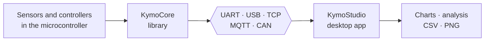

<p align="center">
  <a href="README.md"></a>
  <a href="README.de.md"></a>
</p>

<p align="center">
  <picture>
    <source media="(prefers-color-scheme: dark)" srcset="docs/brand/kymotrace-logo-dark.svg">
    
  </picture>
</p>

<h3 align="center">KymoStudio · See, understand and analyse live measurement data</h3>

<p align="center">
  The desktop workbench for measurements from microcontrollers, sensors and networks.
</p>

<p align="center">
  
  
  
  
</p>

<p align="center">
  
</p>

---

## What is it about?

Anyone working with microcontrollers, sensors or control loops knows the
problem: the interesting values live inside the device, and all you have to see
them is `Serial.print`, a basic plotter with a single curve, or tediously
digging through log files.

**KymoStudio** brings this data to your screen live, and does it properly:
- several sources at the same time
- any number of signals across multiple charts
- real XY and 3D views instead of just curves over time
- analysis and export without interrupting the recording

The goal is a tool that feels like a good measuring instrument: **precise, calm
and honest**. The interface always shows whether data is arriving, whether
anything is being lost and what is currently displayed. There are no decorative
effects. The measurement task comes first.

## What KymoStudio can do

| | |
|---|---|
| **Many sources at once** | Serial (UART/USB), TCP, MQTT, CAN and a built-in test generator. Each source can be started and stopped individually. |
| **Understands your data** | The compact Kymotrace binary protocol, plain numbers as text, or JSON. The format is detected automatically. |
| **Four chart types** | Time series Y(t), XY line, XY scatter and XYZ in 3D. X and Y come straight from the data packet. |
| **Flexible workspace** | Tile charts, bring one into focus or arrange them freely. Assign signals by drag & drop. |
| **Look closely** | Mouse-wheel zoom, panning, fit with a double click and a crosshair with value readout. Axes can also be set manually. |
| **Analysis** | Count, minimum, maximum, mean, root mean square (RMS) and standard deviation, computed from the raw data, not from the display. |
| **Export** | Raw data as CSV, the workspace as PNG, the configuration as JSON. |
| **Pause without losing data** | Freeze the display while acquisition keeps running in the background. |
| **Transparent under load** | Bounded buffers, counters for dropped values and a status bar that shows what is really happening. |

<p align="center">
  
  <br><sub>Real XY traces: characteristic curves, trajectories or Lissajous figures straight from the data stream.</sub>
</p>

## What it is used for

- **Control engineering:** compare setpoint, actual value and controller output of a PID loop side by side and tune parameters live.
- **Sensor development:** make noise, drift and step response visible and back them up with statistics.
- **Drives and power electronics:** follow current, voltage, speed and position in parallel.
- **Robotics and motion:** show paths and positions as XY or 3D views instead of columns of numbers.
- **Test benches and vehicles:** analyse signals from the CAN bus and MQTT together with serial sources.
- **Teaching, university and maker projects:** make physics and electronics tangible. The test generator works without any hardware.

## The Kymotrace ecosystem



| Project | Role |
|---|---|
| **[KymoStudio](https://github.com/CodeName-666/kymostudio)** | this repository: receive, display, analyse, export |
| [KymoCore](https://github.com/CodeName-666/kymocore) | portable C++11 library that captures and sends measurements on the microcontroller |
| [KymoProbe](https://github.com/CodeName-666/kymoprobe) | ready-made firmware and examples for ESP32, Arduino and STM32 |

KymoStudio also works without KymoCore. Any source that sends numbers as text
or JSON can be displayed directly.

## Try it quickly

With Python 3.12. The demo needs no hardware:

```bash
python -m venv .venv
.venv/Scripts/python -m pip install -r requirements.txt     # Linux/macOS: .venv/bin/python
.venv/Scripts/python run.py --demo
```

On Windows, `start_windows.bat` also launches the application afterwards.
Installation, operation, keyboard shortcuts, limits and configuration are
described in the **[manual](docs/MANUAL.md)**.

## Documentation

- **[Manual](docs/MANUAL.md):** installation, operation, data integrity, configuration and checks
- **[Architecture](docs/ARCHITEKTUR.md):** structure of the Python backend and the QML interface (German)
- **[Test report](docs/TESTBERICHT.md)** (German) · **[Changelog](CHANGELOG.md)** · **[Logo and design](docs/brand/BRAND.md)** (German) · **[Contributing](CONTRIBUTING.md)**

## License

Copyright (c) 2026 Christof Seidel. KymoStudio is dual-licensed:

- **GPLv3** ([LICENSE](LICENSE)) is free of charge, for example for hobby,
  tinkering, learning and open-source projects.
- A **commercial license** is required to distribute KymoStudio in
  proprietary products. Companies are asked to purchase one for productive
  use as well.

Details, including the Qt modules, are in [COMMERCIAL.md](COMMERCIAL.md).
