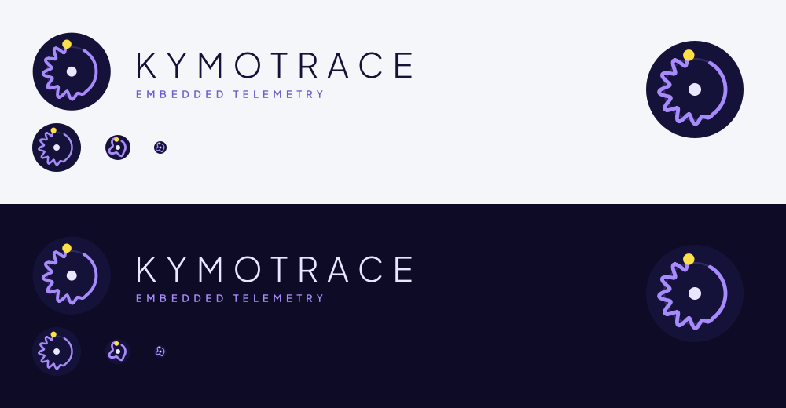

# Kymotrace – Designbeschreibung



## Idee: der Signal-Ring

Ein **Kymograph** ist ein historisches Messgerät. Ein Schreibstift zeichnet ein
Signal auf eine rotierende Trommel. Kymotrace macht dasselbe digital: Ein
Mikrocontroller misst, KymoStudio zeichnet live mit.

Das Logo zeigt diese Trommel **von oben**:

| Element | Form | Bedeutung |
|---|---|---|
| Grundfläche | dunkelindigoblauer Kreis | die Trommel / das Instrument |
| Achse | heller Punkt in der Mitte | Drehachse, das ruhende Zentrum |
| Spur | feine Kreislinie | die Bahn, auf der geschrieben wird |
| Grundlinie | ruhiger Bogen (rechts) | noch kein Signal, das System wartet |
| Messkurve | Welle, die einsetzt (links) | ankommende Messwerte |
| Schreibspitze | gelber Punkt am Ende | der aktuelle Live-Messwert |

Der Ring ist bewusst nicht geschlossen. Die Lücke zwischen Schreibspitze und
Grundlinie steht für „es geht weiter“: Die Aufzeichnung läuft.

Charakter: **präzise, ruhig, instrumentenhaft**. Kymotrace soll eher wie ein
Messinstrument wirken als wie eine beliebige App.

## Bildmarke

- Raster 64 × 64, Kreis r = 31, Spur r = 19,5, Wellenamplitude 3,3, 11 Schwingungen.
- Die Kurve läuft im Uhrzeigersinn: Start bei −60°, Ende bei 260°. Die ersten
  35 % sind Grundlinie, danach schwillt das Signal innerhalb von 15 % auf
  volle Höhe an.
- Mindestgröße der vollen Marke: 40 px. Darunter (32/24/16 px) wird das
  **Favicon** verwendet: weniger, größere Wellen, dickere Linie, größere Spitze.
- Schutzraum rundum: mindestens ¼ des Durchmessers.
- Die Kurve wird berechnet und nicht von Hand gezeichnet. Wer die Marke
  ändern will, passt die Parameter an (siehe „Erzeugung“) und erzeugt sie neu.

## Wortmarke und Claim

```
KYMOTRACE
EMBEDDED TELEMETRY
```

- **KYMOTRACE** in Versalien, Plus Jakarta Sans **Light**, weit gesperrt.
- **EMBEDDED TELEMETRY** darunter in Versalien, Plus Jakarta Sans
  **SemiBold**, klein und gesperrt, in Violett.
- Schrift: [Plus Jakarta Sans](https://fonts.google.com/specimen/Plus+Jakarta+Sans),
  Open Font License, also auch kommerziell frei nutzbar.
- In den Logo-Dateien ist die Schrift bereits in **Pfade** umgewandelt. Zum
  Anzeigen muss keine Schrift installiert sein.
- Im Fließtext wird der Name normal geschrieben: „Kymotrace“, „KymoStudio“,
  „KymoProbe“, „KymoCore“.

## Farben

| Rolle | Name | Hex | Einsatz |
|---|---|---|---|
| Primär | Indigo | `#15123A` | Grundfläche der Marke, Text auf hellem Grund |
| Primär | Nebel | `#E9E6FF` | Achse, Text auf dunklem Grund |
| Struktur | Spur | `#2E2A66` | feine Linien, Rahmen, Raster |
| Akzent | Signal-Violett | `#A78BFA` | Messkurve, Claim auf dunklem Grund, aktive Zustände |
| Akzent | Violett dunkel | `#6D5BD0` | Claim und Links auf hellem Grund (Kontrast ≥ 4,5:1) |
| Akzent | Live-Gelb | `#FDE047` | **nur** für den Live-Punkt / „läuft gerade“ |
| Fläche dunkel | Nacht | `#0D0B26` | Dark-Mode-Hintergrund |

Gelb ist für „live“ reserviert. In der App bedeutet diese Farbe immer: Hier
kommen gerade Daten an.

## Produktfamilie

Alle Produkte nutzen dieselbe Bildmarke. Die Produktbezeichnung ersetzt den
Claim unter der Wortmarke:

| Produkt | Zeile unter KYMOTRACE |
|---|---|
| KymoStudio (Desktop-App) | STUDIO |
| KymoProbe (Firmware) | PROBE |
| KymoCore (Library) | CORE |

## Nicht erlaubt

- Den Ring schließen oder die Grundlinie mit Welle füllen. Er darf nicht wie ein Zahnrad wirken.
- Die Marke drehen. Die Schreibspitze liegt immer oben.
- Die Kurve in einer anderen Farbe als Signal-Violett darstellen oder den gelben Punkt weglassen.
- Die Marke mit Schatten, Verlauf oder 3D-Effekt versehen.
- Die Wortmarke in Kleinbuchstaben oder fett setzen.

## Dateien

| Datei | Zweck |
|---|---|
| `kymotrace-mark.svg` | Bildmarke (ab 40 px) |
| `kymotrace-favicon.svg` | vereinfachte Marke für 16–32 px |
| `kymotrace-logo-light.svg` | Logo mit Wortmarke und Claim für helle Hintergründe |
| `kymotrace-logo-dark.svg` | Logo mit Wortmarke und Claim für dunkle Hintergründe |
| `kymotrace-mark-512.png` | Rastergrafik, zum Beispiel für GitHub- oder Social-Media-Avatar |
| `kymotrace-uebersicht.png` | Übersicht aller Varianten |
| `../../resources/icons/kymotrace.ico` | Windows-Icon mit 16–256 px, wird von der App genutzt |
| `../../resources/icons/kymotrace.svg` | Bildmarke für die App |
| `entwuerfe/` | verworfene Entwürfe (K-Kurve, Chip, Pegel, Monogramm, Kolibri, Sechseck) |

## Erzeugung

Alle Dateien erzeugt `tools/build_brand.py` (`.venv/Scripts/python.exe tools/build_brand.py`). Die Kurvenparameter stehen in
der Funktion `ring_path()`, die Farben im Dictionary `C`. Für das
Umwandeln der Schrift in Pfade muss Plus Jakarta Sans installiert sein.
